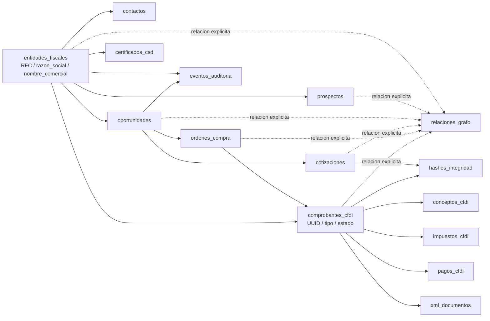
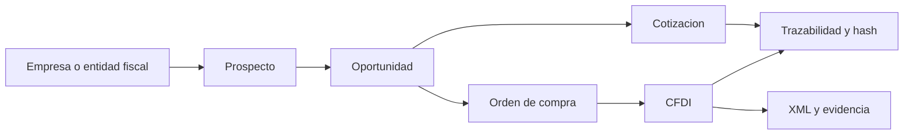

# Diagrama de Grafos CRM-CFDI Canonico

Este documento describe el modelo de grafo relacional usado como base canonica para interoperar entre el CRM y un digestor integral de CFDI.

## Objetivo

El objetivo del modelo es representar relaciones de negocio y relaciones fiscales sin amarrarse a una sola base de datos ni a una sola vista de aplicacion.

Se busca que el mismo modelo permita:

- trabajar en SQLite y PostgreSQL
- navegar desde CRM hacia CFDI y de CFDI hacia CRM
- conservar identidad fiscal por RFC y documentos fiscales por UUID
- soportar trazabilidad, hashes e integridad forense

## Principios del modelo

### 1. Identidad fiscal compartida

La entidad central del grafo es `entidades_fiscales`.

- `rfc` es la llave de negocio principal
- `razon_social` es la identidad legal
- `nombre_comercial` es la identidad operativa o de despliegue
- el `id_entidad` sigue siendo la llave tecnica

### 2. Documento fiscal como nodo propio

Cada CFDI vive como nodo en `comprobantes_cfdi`.

- `uuid` es la llave de negocio del documento
- `id_emisor` y `id_receptor` conectan el CFDI con las entidades fiscales
- `id_oc` permite amarrarlo al flujo comercial del CRM

### 3. Relaciones explicitadas

Aunque el modelo es relacional, la tabla `relaciones_grafo` hace explicitas las aristas para poder recorrer el sistema como grafo.

Esto evita depender solo de joins implícitos y ayuda a:

- exploracion bidireccional
- auditoria de vinculos
- compatibilidad futura con motores de grafo o capas semanticas

## Diagrama de alto nivel



## Vista ejecutiva

Esta vista resume el modelo en lenguaje de negocio.



Lectura ejecutiva:

- una entidad fiscal puede entrar al CRM como prospecto
- el prospecto madura a oportunidad
- la oportunidad genera cotizacion y despues orden de compra
- la orden de compra habilita el CFDI
- el CFDI conserva XML, auditoria e integridad
- el mismo flujo puede recorrerse en sentido inverso desde el UUID

## Lectura funcional del grafo

### Subgrafo CRM

Recorre el embudo comercial desde identidad hasta cierre operativo.

- `entidades_fiscales` representa empresa, cliente, emisor, receptor o entidad mixta
- `contactos` representa personas operativas o fiscales
- `prospectos` representa el estado comercial inicial
- `oportunidades` modela pipeline, probabilidad y estado comercial
- `cotizaciones` representa propuesta comercial trazable
- `ordenes_compra` representa la aprobacion operativa que habilita facturacion

Ruta tipica:

`entidades_fiscales -> prospectos -> oportunidades -> cotizaciones -> ordenes_compra`

### Subgrafo CFDI

Modela el comprobante ya como objeto fiscal.

- `comprobantes_cfdi` es el nodo principal del documento
- `conceptos_cfdi` representa partidas o renglones
- `impuestos_cfdi` representa traslados o retenciones
- `pagos_cfdi` representa recepcion y conciliacion de pagos
- `xml_documentos` conserva el XML emitido, recibido o digerido
- `certificados_csd` representa la capacidad operativa del emisor

Ruta tipica:

`entidades_fiscales -> comprobantes_cfdi -> conceptos_cfdi / impuestos_cfdi / pagos_cfdi / xml_documentos`

### Puentes CRM-CFDI

La compatibilidad bidireccional depende de estos puentes:

- `entidades_fiscales.rfc` une identidad fiscal y comercial
- `ordenes_compra.id_oc` conecta cierre comercial con facturacion
- `comprobantes_cfdi.uuid` permite digestión, reconciliacion y consulta fiscal
- `relaciones_grafo` hace navegables las relaciones de manera uniforme

## Correspondencia con el esquema canonico

El diagrama se materializa principalmente en [db/migrations/001_schema_canonico_postgres.sql](db/migrations/001_schema_canonico_postgres.sql).

### Nodos principales

- `entidades_fiscales`
- `contactos`
- `prospectos`
- `oportunidades`
- `cotizaciones`
- `ordenes_compra`
- `comprobantes_cfdi`
- `conceptos_cfdi`
- `impuestos_cfdi`
- `pagos_cfdi`
- `xml_documentos`
- `certificados_csd`

### Nodos transversales

- `eventos_auditoria`
- `hashes_integridad`
- `relaciones_grafo`

## Semantica de las aristas

La tabla `relaciones_grafo` usa la forma:

- `nodo_origen_tipo`
- `nodo_origen_id`
- `tipo_relacion`
- `nodo_destino_tipo`
- `nodo_destino_id`

Ejemplos de aristas validas:

- `entidades_fiscales -> tiene_contacto -> contactos`
- `entidades_fiscales -> tiene_prospecto -> prospectos`
- `prospectos -> evoluciona_a -> oportunidades`
- `oportunidades -> genera -> cotizaciones`
- `oportunidades -> recibe -> ordenes_compra`
- `ordenes_compra -> sustenta -> comprobantes_cfdi`
- `entidades_fiscales -> actua_como_emisor -> comprobantes_cfdi`
- `entidades_fiscales -> actua_como_receptor -> comprobantes_cfdi`

## Reglas de identidad y negocio

### RFC

- debe ser unico por entidad fiscal
- es la referencia natural para interoperabilidad externa
- no reemplaza al identificador tecnico interno

### UUID CFDI

- debe ser unico por comprobante
- permite reconciliar XML, factura, pago y trazabilidad

### Orden de compra

- funciona como puente natural entre oportunidad y facturacion
- evita que el CFDI quede aislado del flujo comercial

## Compatibilidad SQLite y PostgreSQL

El modelo nace con mentalidad relacional portable.

- SQLite puede operar como runtime local o staging
- PostgreSQL puede operar como fuente canonica multiusuario
- el grafo no depende de extensiones exclusivas de Postgres
- la semantica de red se mantiene en la tabla `relaciones_grafo`

## Casos de uso que habilita

### Desde CRM hacia CFDI

Ejemplo: desde una oportunidad ganada se puede localizar la OC, luego el CFDI emitido y finalmente el XML.

### Desde CFDI hacia CRM

Ejemplo: desde un UUID digerido se puede localizar al receptor, la OC asociada, la cotizacion que lo origino y la oportunidad que lo justifico.

### Trazabilidad forense

Ejemplo: un cambio en cotizacion o factura puede rastrearse con `eventos_auditoria` y validarse con `hashes_integridad`.

## Consultas de recorrido del grafo

Esta seccion aterriza el diagrama en consultas utiles para operacion, auditoria e integracion.

## 1. De oportunidad a CFDI emitido

Caso: partir de una oportunidad y encontrar su OC y su CFDI asociado.

```sql
SELECT
    o.id_oportunidad,
    o.nombre AS oportunidad,
    oc.id_oc,
    oc.numero_oc,
    c.id_cfdi,
    c.uuid,
    c.estado,
    c.fecha_emision
FROM oportunidades o
LEFT JOIN ordenes_compra oc ON oc.id_oportunidad = o.id_oportunidad
LEFT JOIN comprobantes_cfdi c ON c.id_oc = oc.id_oc
WHERE o.id_oportunidad = :id_oportunidad;
```

Lectura:

- si existe oportunidad pero no OC, el flujo comercial no ha llegado a cierre operativo
- si existe OC pero no CFDI, hay cierre comercial sin facturacion
- si existe CFDI, ya hay rastro fiscal directo del negocio

## 2. De UUID CFDI a oportunidad origen

Caso: partir de un CFDI digerido o consultado por UUID y regresar al origen comercial.

```sql
SELECT
    c.uuid,
    oc.numero_oc,
    o.id_oportunidad,
    o.nombre AS oportunidad,
    o.estado AS estado_oportunidad,
    ef.rfc,
    ef.razon_social
FROM comprobantes_cfdi c
LEFT JOIN ordenes_compra oc ON oc.id_oc = c.id_oc
LEFT JOIN oportunidades o ON o.id_oportunidad = oc.id_oportunidad
LEFT JOIN entidades_fiscales ef ON ef.id_entidad = o.id_entidad
WHERE c.uuid = :uuid;
```

Lectura:

- responde la pregunta de negocio: este CFDI de donde vino
- sirve para conciliacion entre digestor CFDI y pipeline comercial

## 3. De RFC a todo el historial comercial y fiscal

Caso: tomar una entidad fiscal y desplegar sus nodos relacionados.

```sql
SELECT
    ef.id_entidad,
    ef.rfc,
    ef.razon_social,
    p.id_prospecto,
    o.id_oportunidad,
    q.id_cotizacion,
    oc.id_oc,
    c.id_cfdi,
    c.uuid
FROM entidades_fiscales ef
LEFT JOIN prospectos p ON p.id_entidad = ef.id_entidad
LEFT JOIN oportunidades o ON o.id_entidad = ef.id_entidad
LEFT JOIN cotizaciones q ON q.id_oportunidad = o.id_oportunidad
LEFT JOIN ordenes_compra oc ON oc.id_entidad = ef.id_entidad AND oc.id_oportunidad = o.id_oportunidad
LEFT JOIN comprobantes_cfdi c ON c.id_oc = oc.id_oc
WHERE ef.rfc = :rfc;
```

Lectura:

- sirve para vista 360 de una empresa
- permite identificar entidades con pipeline sin facturacion o con facturacion sin contexto suficiente

## 4. Recorrido explicitado por relaciones_grafo

Caso: explorar el grafo sin depender de joins fijos de aplicacion.

```sql
SELECT
    rg.nodo_origen_tipo,
    rg.nodo_origen_id,
    rg.tipo_relacion,
    rg.nodo_destino_tipo,
    rg.nodo_destino_id,
    rg.creado_en
FROM relaciones_grafo rg
WHERE rg.nodo_origen_tipo = 'oportunidades'
  AND rg.nodo_origen_id = :id_oportunidad
ORDER BY rg.creado_en;
```

Lectura:

- util para capas de visualizacion de red
- util para auditar si la ETL y la sincronizacion dejaron aristas correctas

## 5. Emisor y receptor de un CFDI

Caso: verificar identidad fiscal completa de ambos lados del comprobante.

```sql
SELECT
    c.uuid,
    em.rfc AS rfc_emisor,
    em.razon_social AS emisor,
    re.rfc AS rfc_receptor,
    re.razon_social AS receptor,
    c.total,
    c.moneda,
    c.estado
FROM comprobantes_cfdi c
JOIN entidades_fiscales em ON em.id_entidad = c.id_emisor
JOIN entidades_fiscales re ON re.id_entidad = c.id_receptor
WHERE c.uuid = :uuid;
```

Lectura:

- sirve para timbrado, validacion y reconciliacion fiscal
- permite detectar si un CFDI quedó ligado a una entidad incorrecta

## 6. XML y trazabilidad forense de un CFDI

Caso: bajar desde el documento fiscal al XML y al hash asociado.

```sql
SELECT
    c.uuid,
    x.id_xml,
    x.hash_xml,
    x.origen,
    h.hash_sha256,
    h.timestamp_hash
FROM comprobantes_cfdi c
LEFT JOIN xml_documentos x ON x.id_cfdi = c.id_cfdi
LEFT JOIN hashes_integridad h
    ON h.tabla_origen = 'comprobantes_cfdi'
   AND h.id_registro = c.id_cfdi
WHERE c.uuid = :uuid;
```

Lectura:

- separa claramente el documento fiscal del artefacto XML
- permite auditar integridad de almacenamiento y digestión

## 7. Eventos de auditoria de una cotizacion o factura

Caso: revisar cambios historicos en una entidad sensible.

```sql
SELECT
    entidad_tipo,
    entidad_id,
    accion,
    usuario,
    timestamp_evento,
    hash_evento
FROM eventos_auditoria
WHERE entidad_tipo = :entidad_tipo
  AND entidad_id = :entidad_id
ORDER BY timestamp_evento DESC;
```

Valores tipicos para `:entidad_tipo`:

- `cotizacion`
- `factura`
- `orden_compra`
- `oportunidad`

## 8. Consulta tipo embudo con salida fiscal

Caso: detectar donde se rompe el flujo CRM -> OC -> CFDI.

```sql
SELECT
    ef.razon_social,
    o.id_oportunidad,
    o.estado AS estado_oportunidad,
    oc.numero_oc,
    c.uuid,
    CASE
        WHEN oc.id_oc IS NULL THEN 'sin_oc'
        WHEN c.id_cfdi IS NULL THEN 'con_oc_sin_cfdi'
        ELSE 'flujo_completo'
    END AS estado_flujo
FROM entidades_fiscales ef
JOIN oportunidades o ON o.id_entidad = ef.id_entidad
LEFT JOIN ordenes_compra oc ON oc.id_oportunidad = o.id_oportunidad
LEFT JOIN comprobantes_cfdi c ON c.id_oc = oc.id_oc;
```

Lectura:

- sirve para monitoreo operativo
- ayuda a priorizar conversion de pipeline a facturacion real

## Notas de uso

- Los ejemplos usan parametros tipo `:uuid`, `:rfc` o `:id_oportunidad` para mantenerlos agnosticos.
- En PostgreSQL pueden cambiarse por `%s` si se ejecutan desde `psycopg`.
- En SQLite se pueden usar `?` si la consulta se ejecuta desde `sqlite3`.
- Para visualizacion de red, la fuente mas estable es `relaciones_grafo`.
- Para consistencia transaccional y reporteo, la fuente mas estable sigue siendo el modelo relacional base.

## Ejemplos Python

Esta seccion muestra como consultar el modelo sin acoplar la logica a una sola base.

## 1. PostgreSQL con psycopg

Ejemplo: buscar un CFDI por UUID y regresar su contexto comercial.

```python
import os

import psycopg


SQL = """
SELECT
    c.uuid,
    oc.numero_oc,
    o.nombre AS oportunidad,
    ef.rfc,
    ef.razon_social
FROM comprobantes_cfdi c
LEFT JOIN ordenes_compra oc ON oc.id_oc = c.id_oc
LEFT JOIN oportunidades o ON o.id_oportunidad = oc.id_oportunidad
LEFT JOIN entidades_fiscales ef ON ef.id_entidad = o.id_entidad
WHERE c.uuid = %s
"""


def buscar_contexto_cfdi(uuid: str) -> dict | None:
    database_url = os.environ["DATABASE_URL"]
    with psycopg.connect(database_url) as conn:
        with conn.cursor() as cur:
            cur.execute(SQL, (uuid,))
            row = cur.fetchone()
            if row is None:
                return None
            return {
                "uuid": row[0],
                "numero_oc": row[1],
                "oportunidad": row[2],
                "rfc": row[3],
                "razon_social": row[4],
            }
```

## 2. SQLite con sqlite3

Ejemplo: revisar el embudo comercial local y detectar oportunidades sin CFDI.

```python
import sqlite3
from pathlib import Path


SQL = """
SELECT
    e.nombre,
    o.id_oportunidad,
    o.etapa,
    oc.numero_oc,
    f.uuid
FROM empresas e
JOIN prospectos p ON p.id_empresa = e.id_empresa
JOIN oportunidades o ON o.id_prospecto = p.id_prospecto
LEFT JOIN ordenes_compra oc ON oc.id_oportunidad = o.id_oportunidad
LEFT JOIN facturas f ON f.id_oc = oc.id_oc
ORDER BY e.nombre, o.id_oportunidad
"""


def revisar_embudo_local(db_path: Path) -> list[dict]:
    con = sqlite3.connect(str(db_path))
    try:
        con.row_factory = sqlite3.Row
        rows = con.execute(SQL).fetchall()
        return [dict(row) for row in rows]
    finally:
        con.close()
```

## 3. Resolver relaciones desde relaciones_grafo

Ejemplo: recorrer aristas explicitas de una oportunidad.

```python
import os

import psycopg


SQL = """
SELECT
    tipo_relacion,
    nodo_destino_tipo,
    nodo_destino_id
FROM relaciones_grafo
WHERE nodo_origen_tipo = %s
  AND nodo_origen_id = %s
ORDER BY creado_en
"""


def relaciones_de_oportunidad(id_oportunidad: int) -> list[dict]:
    database_url = os.environ["DATABASE_URL"]
    with psycopg.connect(database_url) as conn:
        with conn.cursor() as cur:
            cur.execute(SQL, ("oportunidades", id_oportunidad))
            rows = cur.fetchall()
            return [
                {
                    "tipo_relacion": row[0],
                    "nodo_destino_tipo": row[1],
                    "nodo_destino_id": row[2],
                }
                for row in rows
            ]
```

## 4. Validar integridad forense de una factura

Ejemplo: recuperar hash y eventos asociados a un CFDI.

```python
import os

import psycopg


SQL = """
SELECT
    c.uuid,
    h.hash_sha256,
    e.accion,
    e.timestamp_evento
FROM comprobantes_cfdi c
LEFT JOIN hashes_integridad h
    ON h.tabla_origen = 'comprobantes_cfdi'
   AND h.id_registro = c.id_cfdi
LEFT JOIN eventos_auditoria e
    ON e.entidad_tipo = 'factura'
   AND e.entidad_id = c.id_cfdi
WHERE c.uuid = %s
ORDER BY e.timestamp_evento DESC
"""


def auditoria_cfdi(uuid: str) -> list[dict]:
    database_url = os.environ["DATABASE_URL"]
    with psycopg.connect(database_url) as conn:
        with conn.cursor() as cur:
            cur.execute(SQL, (uuid,))
            rows = cur.fetchall()
            return [
                {
                    "uuid": row[0],
                    "hash_sha256": row[1],
                    "accion": row[2],
                    "timestamp_evento": row[3],
                }
                for row in rows
            ]
```

## 5. Recomendacion de implementacion

Si la consulta busca consistencia funcional del negocio, usa joins directos sobre tablas canonicas.

Si la consulta busca exploracion de red, visualizacion o auditoria de vinculos, usa `relaciones_grafo`.

Si la consulta busca compatibilidad con la app legacy actual, mantén el acceso SQLite en modo transicional y usa ETL hacia PostgreSQL como fuente canonica.

## Recomendacion de helper interno futuro

Si se agrega asistencia inteligente entre etapas, la recomendacion actual es mantenerla interna, deterministica y no basada en LLM.

Debe leer al menos estas señales:

- completitud de datos por etapa
- tiempo transcurrido desde el ultimo avance
- bloqueos funcionales, por ejemplo sin contacto, sin OC o sin configuracion CFDI
- trazabilidad historica de conversion y estancamiento

Debe devolver al usuario:

- siguiente paso recomendado
- datos faltantes para avanzar
- riesgo operativo si no se ejecuta la siguiente accion
- prioridad sugerida del caso

No debe decidir por texto libre ni inventar rutas. Su primera version debe comportarse como motor de reglas auditable sobre el flujo CRM -> OC -> CFDI.

## Alcance actual

Este documento describe el modelo objetivo y su aterrizaje canonico en PostgreSQL. La app actual todavia corre sobre esquema legado SQLite y usa scripts de ETL para sincronizar al modelo canonico.

Archivos relacionados:

- [db/migrations/001_schema_canonico_postgres.sql](db/migrations/001_schema_canonico_postgres.sql)
- [scripts/migrate_sqlite_to_canonical_pg.py](scripts/migrate_sqlite_to_canonical_pg.py)
- [crm_exo_v2/core/db_runtime.py](crm_exo_v2/core/db_runtime.py)
